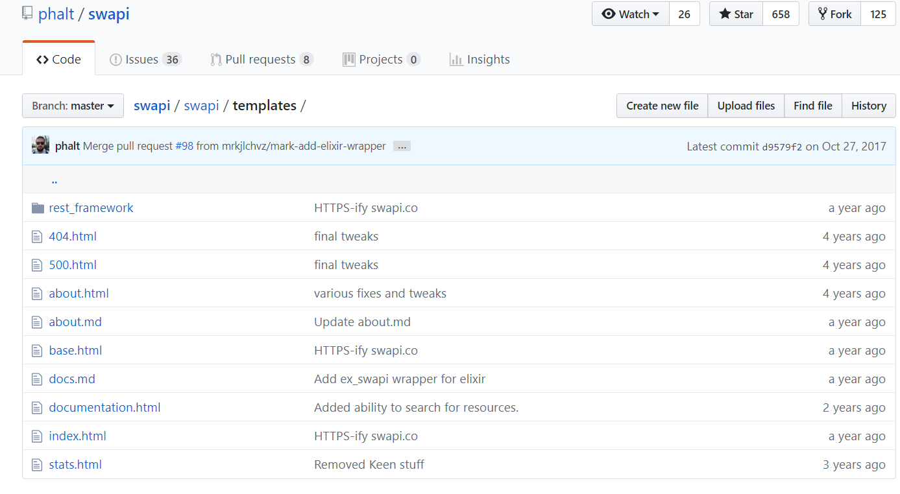

# 项目总结

## 负责工作

这一次实验负责前端部分的开发，采用的现学的`vue`中的基本功能来实现对 `swapi` 网站的复刻。

## 工作流程

一开始想法是由于是复刻，可不可以直接复制网站的源文件（js,html,css)，作为前端就可以了呢，这样做实际上确实能够实现基本的功能，但是存在以下的问题

- 实现过于暴力，直接通过网站下载下来的代码确实没有问题，但是这种现代网站开发通常分为 `production` 和 `development` 两种版本，这种直接下载下来的版本属于`production`，不是开发者开发的时候写的源文件，主要是为了性能而优化了很多，而且大部分都是通过打包工具（webpack/grunt）之类打包，可读性较差。

- 另外有一点就是不符合本次实验的要求。

排除这个选项之后，在网页上你可以看到作者开源了这个网站的后端代码，点进去看之后，可以发现并没有使用打包工具，而是后端使用模板(pug)动态生成html，然后后端再提供静态文件服务和作为api服务器，既然开源了模板文件，我们就可以在这个的基础上进行二次开发。



开源仓库的模板写得合理，仿照这个开源仓库的html模板来组织`vue`的组件大致结构如下所示

``` bash
└─Main
    └─Home
    └─About
    └─Document
```

观察可以发现3个页面都用到了同样的 `header` 和 `footer`，显然这个是可以作为一个组件复用，之后可以看到每个页面的主体部分都是`markdown`渲染效果的文档。通过查看开源仓库可以发现这一部分的内容确实是通过把`mardown`文件通过插件转成 html 插入模板中。前端的话，`vue` 同样也能通过插件实现相似的功能，具体可以参考`vue-markdown`的文档。

另外关于页面的跳转方面,开源仓库中，是每一次点击都从后端拿到新的页面，浏览器刷新。由于初学`vue`，了解到了其中有一个前端路由的功能，可以提高用户体验，大概的意思就是把东西一次都拿下来，之后用户点击跳转的时候，没有必要再到后端去请求页面，而是直接通过前端直接实现跳转功能。这样做实际上主要还是为了练练手（毕竟学了还是要用一下），按照开源仓库的那种每个页面都请求一次也不见得体验就差（毕竟除了主页其他两个页面使用率很低）。


之后按照本次实验的要求，首先需要和后端人员协商好api。在本次实验中使用到的 api 访问服务器的部分集中在主页，而且api都已经在后端说明文档已经给出给出就不再赘述。

最后在所有的任务的完成之后，可以使用 vue 本身提供的方便的工具 `vue-cli`，来进行构建打包，构建之后就可以形成一个 `dist` 文件夹，里面包含了构建之后的结构，把这个放到后端，然后后端就可以进行相关的部署。

另外还有几点值得提一下

- 首先是 `vue-cli` 提供/集成了 webpack 的 dev server 功能，能够在没有后端协作的情况下，对项目进行测试，另外这个开发服务器还有提供热加载功能。

- 另外在开发环境下测试 api，需要处理一下跨域请求的问题，之后把请求通过代理转发给api服务器，这样就能测试了。具体的代理设置文件可以查看源代码。


## 总结

- 实验本身是挺有意义，了解了前后端分离的开发方式（关键在于先协商好api）

- 比较可惜的是时间有限没有用上 `GraphQL`